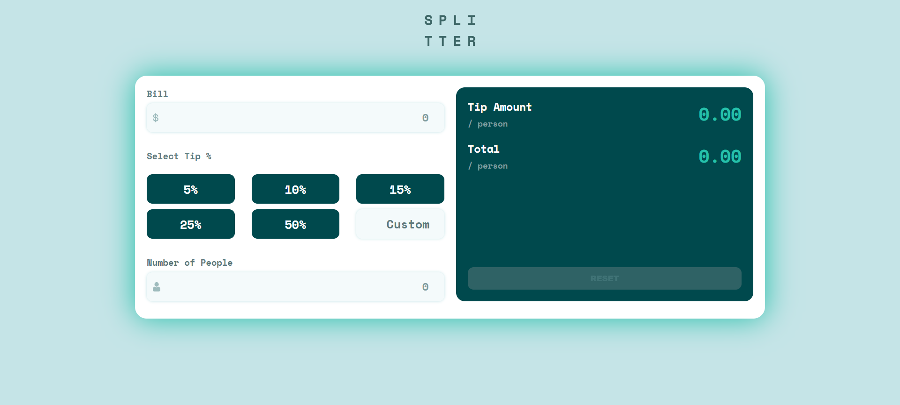

# Frontend Mentor - Tip calculator app solution

This is a solution to the [Tip calculator app challenge on Frontend Mentor](https://www.frontendmentor.io/challenges/tip-calculator-app-ugJNGbJUX). Frontend Mentor challenges help you improve your coding skills by building realistic projects.

## Table of contents

- [Overview](#overview)
  - [The challenge](#the-challenge)
  - [Screenshot](#screenshot)
  - [Links](#links)
- [My process](#my-process)
  - [Built with](#built-with)
  - [What I learned](#what-i-learned)
  - [Continued development](#continued-development)
- [Author](#author)

## Overview

### The challenge

Users should be able to:

- View the optimal layout for the app depending on their device's screen size
- See hover states for all interactive elements on the page
- Calculate the correct tip and total cost of the bill per person

### Screenshot



### Links

- Solution URL: [Github](https://diego2drm.github.io/tip-calculator-app/)
- Live Site URL: [age-calculator-app-main](https://github.com/Diego2Drm/tip-calculator-app) 

## My process

### Built with

- Semantic HTML5 markup
- CSS custom properties
- Flexbox
- Mobile-first workflow
- [React](https://reactjs.org/) - JS library
- [Styled Components](https://styled-components.com/) - For styles


### What I learned

I lerned use styled-Components

```js
import styled, { createGlobalStyle } from "styled-components";

export const GlobalStyle = createGlobalStyle`
*{
  margin: 0;
  padding: 0;
  box-sizing: border-box;
}
html{
  font-size: 62.5%;
  font-family: "Space Mono", monospace;
}
`

export const Theme = {
  colors: {
    Green400: "#26c0ab",
    Green900: "#00494d",
    Grey500: "#5e7a7d",
    Grey400: "#7f9c9f",
    Grey200: "#c5e4e7",
    Grey50: "#f4fafb",
    White: "#ffffff",
  }
}

export const Titulo = styled.h1`
font-size: 3rem;
color: ${Theme.colors.Green900};
`
```
```js
import { ThemeProvider } from "styled-components"
import { GlobalStyle, Theme } from "./GlobalStyle"
import { Hero } from "./components/Hero"
import { Calculator } from "./components/calculator"
import { MyContextProvider } from "./context/MyContext"

function App() {

  return (
    <MyContextProvider>
      <ThemeProvider theme={Theme}>
        <GlobalStyle />
        <Hero>
          <Calculator />
        </Hero>
      </ThemeProvider>
    </MyContextProvider>
  )
}
```

### Continued development

- [Styled Components](https://styled-components.com/) - For styles

## Author

- Website - [Diego Ramírez](https://diego2drm.github.io/Portafolio/)
- Frontend Mentor - [@Diego2Drm](https://www.frontendmentor.io/profile/Diego2Drm)
- Gmail - [diego.ramirez2d03@gmail.com]